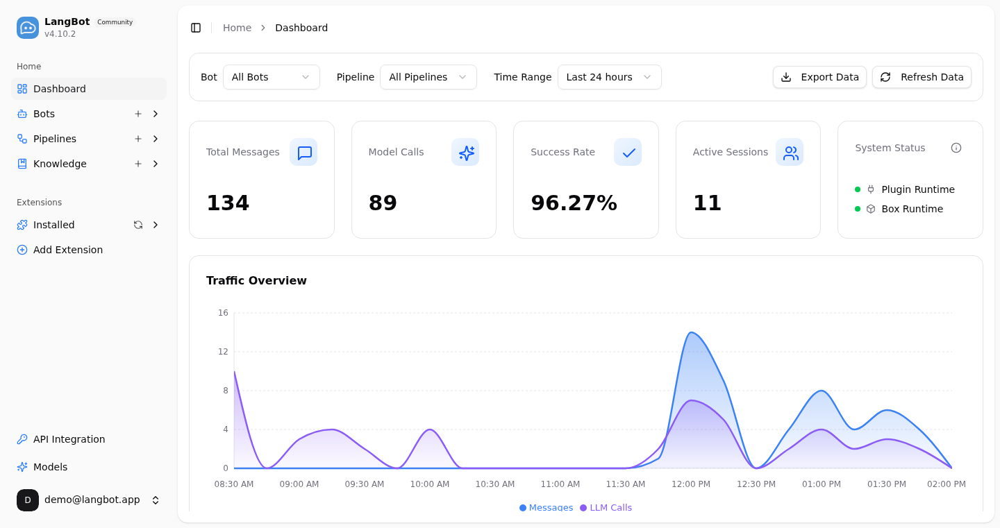

<p align="center">
<a href="https://langbot.app">

</a>

<div align="center">

<a href="https://www.producthunt.com/products/langbot/launches/langbot?embed=true&amp;utm_source=badge-featured&amp;utm_medium=badge&amp;utm_campaign=badge-langbot" target="_blank" rel="noopener noreferrer"></a>

<h3>AI 에이전트 IM 봇 구축을 위한 프로덕션 등급 플랫폼.</h3>
<h4>Slack, Discord, Telegram, WeChat 등에 AI 봇을 빠르게 구축, 디버그 및 배포.</h4>

[English](README.md) / [简体中文](README_CN.md) / [繁體中文](README_TW.md) / [日本語](README_JP.md) / [Español](README_ES.md) / [Français](README_FR.md) / 한국어 / [Русский](README_RU.md) / [Tiếng Việt](README_VI.md)

[](https://discord.gg/wdNEHETs87)
[](https://deepwiki.com/langbot-app/LangBot)
[](https://github.com/langbot-app/LangBot/releases/latest)

[](https://github.com/langbot-app/LangBot/stargazers)

<a href="https://langbot.app">홈</a> ｜
<a href="https://link.langbot.app/en/docs/features">기능</a> ｜
<a href="https://link.langbot.app/en/docs/guide">문서</a> ｜
<a href="https://link.langbot.app/en/docs/api">API</a> ｜
<a href="https://space.langbot.app">플러그인 마켓</a> ｜
<a href="https://langbot.featurebase.app/roadmap">로드맵</a>

</div>

</p>

---

## LangBot이란?

LangBot은 AI 기반 인스턴트 메시징 봇을 구축하기 위한 **오픈소스 프로덕션 등급 플랫폼**입니다. 대규모 언어 모델(LLM)을 모든 채팅 플랫폼에 연결하여 대화, 작업 실행, 기존 워크플로우와의 통합이 가능한 지능형 에이전트를 만들 수 있습니다.

<p align="center">

</p>

### 핵심 기능

- **AI 대화 및 에이전트** — 멀티턴 대화, 도구 호출, 멀티모달 지원, 스트리밍 출력. 내장 RAG(지식 베이스)와 [Dify](https://dify.ai), [Coze](https://coze.com), [n8n](https://n8n.io), [Langflow](https://langflow.org), [Deerflow](https://deerflow.tech), [Weknora](https://weknora.weixin.qq.com) 심층 통합.
- **유니버설 IM 플랫폼 지원** — 단일 코드베이스로 Discord, Telegram, Slack, LINE, QQ, WeChat, WeCom, Lark, DingTalk, KOOK 지원.
- **프로덕션 레디** — 접근 제어, 속도 제한, 민감어 필터링, 종합 모니터링 및 예외 처리. 기업 환경에서 검증됨.
- **플러그인 생태계** — 수백 개의 플러그인, 이벤트 기반 아키텍처, 컴포넌트 확장, [MCP 프로토콜](https://modelcontextprotocol.io/) 지원.
- **웹 관리 패널** — 직관적인 브라우저 인터페이스로 봇을 구성, 관리 및 모니터링. YAML 편집 불필요.
- **멀티 파이프라인 아키텍처** — 다양한 시나리오에 맞는 다양한 봇 구성, 종합 모니터링 및 예외 처리.

[→ 모든 기능 자세히 보기](https://link.langbot.app/en/docs/features)

📍 실전 가이드: [5분 만에 멀티 플랫폼 AI 봇 배포하기](https://langbot.app/en/blog/deploy-ai-bot-in-5-minutes/), [DeepSeek를 WeChat, Discord, Telegram에 연결하기](https://langbot.app/en/blog/connect-deepseek-to-wechat/), [Dify Agent를 Discord, Telegram, Slack에서 실행하기](https://langbot.app/en/blog/dify-agent-discord-telegram-slack/), [n8n 기반 챗봇 만들기](https://langbot.app/en/blog/n8n-multi-platform-ai-chatbot/).

---

## 😎 최신 정보 받기

리포지토리 오른쪽 상단의 Star 및 Watch 버튼을 클릭하여 최신 업데이트를 받으세요.


## 빠른 시작

### ☁️ LangBot Cloud (추천)

**[LangBot Cloud](https://space.langbot.app/cloud)** — 배포 없이 바로 사용.

### 원라인 실행

```bash
uvx langbot
```

> [uv](https://docs.astral.sh/uv/getting-started/installation/) 설치 필요. http://localhost:5300 방문 — 완료.

### Docker Compose

```bash
git clone https://github.com/langbot-app/LangBot
cd LangBot/docker
docker compose --profile all up -d
```

### 원클릭 클라우드 배포

[](https://zeabur.com/en-US/templates/ZKTBDH)
[](https://railway.app/template/yRrAyL?referralCode=vogKPF)

**더 많은 옵션:** [Docker](https://link.langbot.app/en/docs/docker) · [수동 배포](https://link.langbot.app/en/docs/manual-deploy) · [BTPanel](https://link.langbot.app/en/docs/bt-panel) · [Kubernetes](https://docs.langbot.app/en/deploy/langbot/kubernetes)

---

## 지원 플랫폼

| 플랫폼 | 상태 | 비고 |
|--------|------|------|
| Discord | ✅ | 공식 |
| Telegram | ✅ | 공식 |
| Slack | ✅ | 공식 |
| LINE | ✅ | 공식 |
| QQ | ✅ | 개인 및 공식 API (채널, DM, 그룹) |
| WeCom | ✅ | 기업 WeChat, 외부 CS, AI Bot |
| WeChat | ✅ | 개인 및 공식 계정 |
| Lark | ✅ | 공식 |
| DingTalk | ✅ | 공식 |
| KOOK | ✅ | 공식 |
| Satori | ✅ |  |
| Email | ✅ | Matrix, Satori |
| Matrix | ✅ | Signal, WhatsApp, Messenger, iMessage, Mattermost, Google Chat, IRC, XMPP, Zulip 등 여러 브리지 플랫폼 지원 |

---

## 지원 LLM 및 통합

| 제공자 | 유형 | 상태 |
|--------|------|------|
| [OpenAI](https://platform.openai.com/) | LLM | ✅ |
| [Anthropic](https://www.anthropic.com/) | LLM | ✅ |
| [DeepSeek](https://www.deepseek.com/) | LLM | ✅ |
| [Google Gemini](https://aistudio.google.com/prompts/new_chat) | LLM | ✅ |
| [xAI](https://x.ai/) | LLM | ✅ |
| [Moonshot](https://www.moonshot.cn/) | LLM | ✅ |
| [Zhipu AI](https://open.bigmodel.cn/) | LLM | ✅ |
| [Ollama](https://ollama.com/) | 로컬 LLM | ✅ |
| [LM Studio](https://lmstudio.ai/) | 로컬 LLM | ✅ |
| [Dify](https://dify.ai) | LLMOps | ✅ |
| [MCP](https://modelcontextprotocol.io/) | 프로토콜 | ✅ |
| [SiliconFlow](https://siliconflow.cn/) | 게이트웨이 | ✅ |
| [Aliyun Bailian](https://bailian.console.aliyun.com/) | 게이트웨이 | ✅ |
| [Volc Engine Ark](https://console.volcengine.com/ark/region:ark+cn-beijing/model?vendor=Bytedance&view=LIST_VIEW) | 게이트웨이 | ✅ |
| [ModelScope](https://modelscope.cn/docs/model-service/API-Inference/intro) | 게이트웨이 | ✅ |
| [GiteeAI](https://ai.gitee.com/) | 게이트웨이 | ✅ |
| [CompShare](https://www.compshare.cn/?ytag=GPU_YY-gh_langbot) | GPU 플랫폼 | ✅ |
| [PPIO](https://ppinfra.com/user/register?invited_by=QJKFYD&utm_source=github_langbot) | GPU 플랫폼 | ✅ |
| [ShengSuanYun](https://www.shengsuanyun.com/?from=CH_KYIPP758) | GPU 플랫폼 | ✅ |
| [接口 AI](https://jiekou.ai/) | 게이트웨이 | ✅ |
| [302.AI](https://share.302ai.cn/SuTG99) | 게이트웨이 | ✅ |
| [Qiniu](https://www.qiniu.com/ai/agent) | 게이트웨이 | ✅ |

[→ 모든 통합 보기](https://link.langbot.app/en/docs/features)

---

## 왜 LangBot인가?

| 사용 사례 | LangBot 활용 방법 |
|-----------|-------------------|
| **고객 지원** | 지식 베이스를 활용하여 질문에 답변하는 AI 에이전트를 Slack/Discord/Telegram에 배포 |
| **내부 도구** | n8n/Dify 워크플로우를 WeCom/DingTalk에 연결하여 비즈니스 프로세스 자동화 |
| **커뮤니티 관리** | AI 기반 콘텐츠 필터링 및 상호작용으로 QQ/Discord 그룹 관리 |
| **멀티 플랫폼** | 하나의 봇으로 모든 플랫폼 지원. 단일 대시보드에서 관리 |

---

## 라이브 데모

**지금 체험:** https://demo.langbot.dev/
- 이메일: `demo@langbot.app`
- 비밀번호: `langbot123456`

*참고: 공개 데모 환경입니다. 민감한 정보를 입력하지 마세요.*

## AI 에이전트를 위한 설계 🤖

LangBot은 **설계 단계부터 에이전트 친화적**입니다 —— 코딩 에이전트(Claude Code, Codex, Copilot, Cursor 등)가 일급 지원으로 LangBot을 운영·확장·배포할 수 있습니다:

- **MCP 서버** —— LangBot은 내장 [Model Context Protocol](https://modelcontextprotocol.io/) 엔드포인트 `/mcp`를 제공하며, HTTP API와 동일하게 미러링되어 에이전트가 봇·파이프라인·플러그인·모델을 프로그래밍 방식으로 관리할 수 있습니다. 동일한 API 키로 인증하며(`config.yaml`에 전역 키 설정 또는 사용자 키 사용) 로그인 절차가 필요 없습니다. 웹 패널의 **API & MCP** 탭에서 설정합니다.
- **저장소 내 Skills** —— [`skills/`](skills/) 디렉터리는 LangBot 작업의 **단일 진실 공급원**입니다: 플러그인 개발, 코어 개발, E2E 테스트, 배포, LangBot / LangBot Space MCP 서버 운영. 에이전트를 이 디렉터리로 안내하면 빌드 방법을 알게 됩니다.
- **AGENTS.md** —— 모든 저장소에는 [`AGENTS.md`](AGENTS.md)(`CLAUDE.md`로 심볼릭 링크)가 있으며 아키텍처, 규약, 그리고 API 변경 시 MCP 서버와 skills를 동기화해야 한다는 규칙을 설명합니다.
- **`llms.txt`** —— LLM을 위한 기계 판독 가능한 프로젝트 컨텍스트가 웹사이트에 게시되어 있습니다.

> **클라우드 / 마켓플레이스:** [LangBot Space](https://space.langbot.app)도 MCP 서버를 제공하여 에이전트가 Personal Access Token으로 인증해 플러그인 / MCP / Skill 마켓플레이스를 검색하고 조회할 수 있습니다.

---

## 커뮤니티

[](https://discord.gg/wdNEHETs87)

- [Discord 커뮤니티](https://discord.gg/wdNEHETs87)

---

## Star 추이

[](https://star-history.com/#langbot-app/LangBot&Date)

---

## 기여자

LangBot을 더 나은 프로젝트로 만들어 주신 모든 [기여자](https://github.com/langbot-app/LangBot/graphs/contributors)분들께 감사드립니다:

<a href="https://github.com/langbot-app/LangBot/graphs/contributors">
  
</a>
